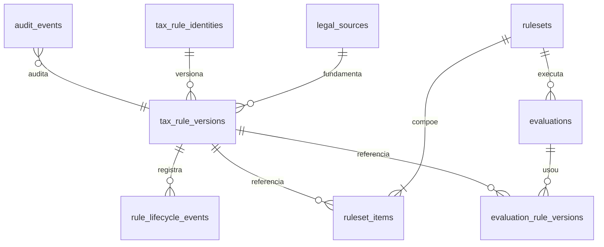

# Persistência governada de regras sintéticas

> Este modelo contém apenas dados fictícios. Ele não autoriza nem representa regra tributária
> brasileira, alíquota, CST, cClassTrib, benefício ou interpretação jurídica.

## Modelo físico



As tabelas são criadas por `database/migrations/versions/0001_governed_tax_rules.py` e
reforçadas por `0002_harden_governance_constraints.py`.

| Tabela | Responsabilidade |
|---|---|
| `legal_sources` | Fonte fictícia separada, URI reservada, jurisdição e hash. |
| `tax_rule_identities` | Identidade lógica estável `TEST-*`. |
| `tax_rule_versions` | Snapshot, vigência jurídica e projeção transacional do lifecycle. |
| `rule_lifecycle_events` | Histórico append-only e bitemporal. |
| `rulesets` | Cabeçalho imutável após publicação. |
| `ruleset_items` | Lista ordenada e exata de versões. |
| `evaluations` | Entrada mínima, hashes, resultado e `DecisionTrace`. |
| `evaluation_rule_versions` | Versões efetivamente usadas na avaliação. |
| `audit_events` | Eventos transversais append-only com metadados seguros. |

## Invariantes em profundidade

- a aplicação valida workflow, metadados e segregação de funções;
- locks `FOR UPDATE` serializam transições e publicação;
- checks protegem intervalos, estados, hashes e metadados mínimos;
- triggers impedem mutação de eventos, snapshots submetidos e rulesets publicados;
- trigger de lifecycle valida continuidade, transição e ordem cronológica;
- trigger de ruleset recusa membro não publicado;
- chaves estrangeiras impedem exclusão de versões referenciadas;
- toda publicação termina em um único `commit`; falha causa rollback integral.

O campo `lifecycle_status` é uma projeção operacional atualizada na mesma transação do evento. A
sequência em `rule_lifecycle_events` continua sendo a fonte histórica e permite resolver o estado
em `known_at`.

## Fingerprint e reprodução

O fingerprint do ruleset usa a lista ordenada de snapshots imutáveis: identidade, versão, hash,
fonte e vigência. Eventos posteriores de retirada ou supersessão não mudam o fingerprint. O
lifecycle é consultado separadamente com o `known_at` arquivado.

Uma reprodução usa os fatos canônicos, `known_at`, ruleset/fingerprint e versão do motor da
avaliação original. Um novo identificador, horário e correlação são registrados, com
`reproduced_from_id` apontando para o envelope original.

## Operação local

```bash
docker compose up -d postgres
uv sync --all-packages --dev
uv run alembic upgrade head
uv run python database/seeds/development_synthetic.py
uv run uvicorn tributaria_api.main:app --app-dir backend/src --reload
```

O seed só executa quando `APP_ENV=development`, é idempotente por identidade e contém unicamente
`TEST-SOURCE-001`, `TEST-RULE-001` e `TEST-RULE-002`. Ele cria versões `DRAFT`; revisão, aprovação,
publicação e ruleset devem passar pelo workflow administrativo.

Alteração manual de schema é proibida. Para verificar o SQL sem banco:

```bash
uv run alembic upgrade head --sql
```

