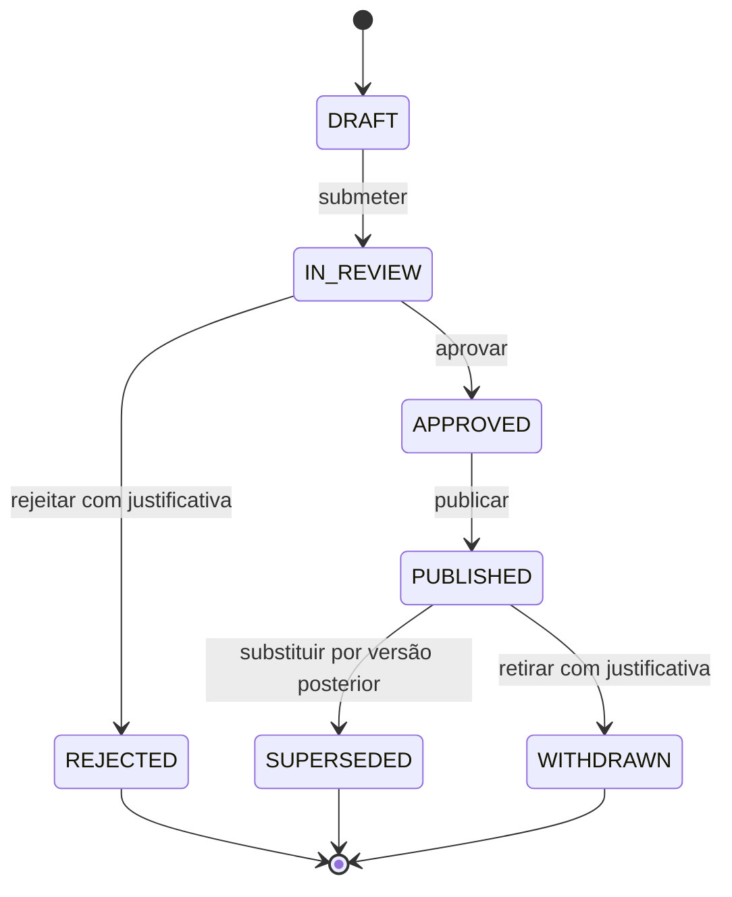

# Modelo do ciclo de vida das regras tributárias

Este documento apresenta o modelo operacional decidido no ADR-0006. Ele não contém regra, alíquota, classificação ou interpretação tributária real.

## Visão geral



Os estados terminais não apagam a versão. Eles encerram novas transições e preservam o snapshot e seus eventos para reprodução e auditoria.

## Dois eixos temporais

```text
vigência jurídica:  valid_from ├────────────────────┤ valid_to (exclusivo)
tempo do sistema:   recorded_at ─ review ─ approval ─ publication ─ supersession
```

- `operation_date` responde: “qual era a data do fato tributário?”.
- `known_at` responde: “o que a plataforma havia publicado naquele instante?”.

Uma avaliação deve informar ambos. A versão é potencialmente elegível somente se estava `PUBLISHED` em `known_at` e se `operation_date` pertence ao intervalo de vigência. O restante das condições é avaliado pelo motor determinístico. Nesta etapa, somente condições sintéticas exercitam esse contrato.

## Agregados e valores

| Elemento | Responsabilidade | Invariantes principais |
| --- | --- | --- |
| `TaxRuleVersion` | representa o snapshot imutável e sua temporalidade jurídica | identidade estável, versão positiva, fonte separada, conteúdo/hash, intervalo válido e `recorded_at` com timezone |
| `RuleLifecycle` | representa o histórico append-only do snapshot | cadeia cronológica, transições permitidas e timestamps derivados |
| `RuleLifecycleEvent` | prova uma mudança de estado | evento único, ator, instante, origem/destino e justificativa quando exigida |
| `RuleLifecycleStatus` | vocabulário fechado do workflow | não confundir com aplicabilidade jurídica |

## Comandos futuros da aplicação

A API não deverá aceitar atualização genérica de status. Casos de uso explícitos deverão expressar intenção:

- `submit_rule_version_for_review`;
- `approve_rule_version`;
- `reject_rule_version`;
- `publish_rule_version`;
- `supersede_rule_version`;
- `withdraw_rule_version`.

Cada comando validará autorização, segregação de funções e idempotência na camada de aplicação, chamará o modelo de domínio e persistirá o novo evento com controle de concorrência. Nenhum desses endpoints está sendo implementado nesta etapa.

## Cenários de auditoria

- **Reprodução histórica:** derivar o status em `known_at` e carregar o snapshot pelo hash registrado na avaliação.
- **Mudança legislativa:** cadastrar versão posterior, revisar, aprovar, publicar e então superseder a anterior com referência explícita.
- **Erro editorial antes da publicação:** rejeitar o snapshot e criar nova versão; não alterar o conteúdo revisado.
- **Retirada excepcional:** registrar `WITHDRAWN` com justificativa; avaliações anteriores continuam apontando para a versão e seus eventos.
- **Concorrência:** rejeitar append quando o último estado persistido não coincidir com o estado esperado pelo comando.

## Persistência futura

O modelo físico provavelmente separará identidade lógica, snapshots, referências legais e eventos. Essa indicação não autoriza criação de tabelas nesta etapa. A primeira migração dependerá de ADR próprio com constraints bitemporais, política de hash, segregação por organização e estratégia de publicação de conjuntos.
