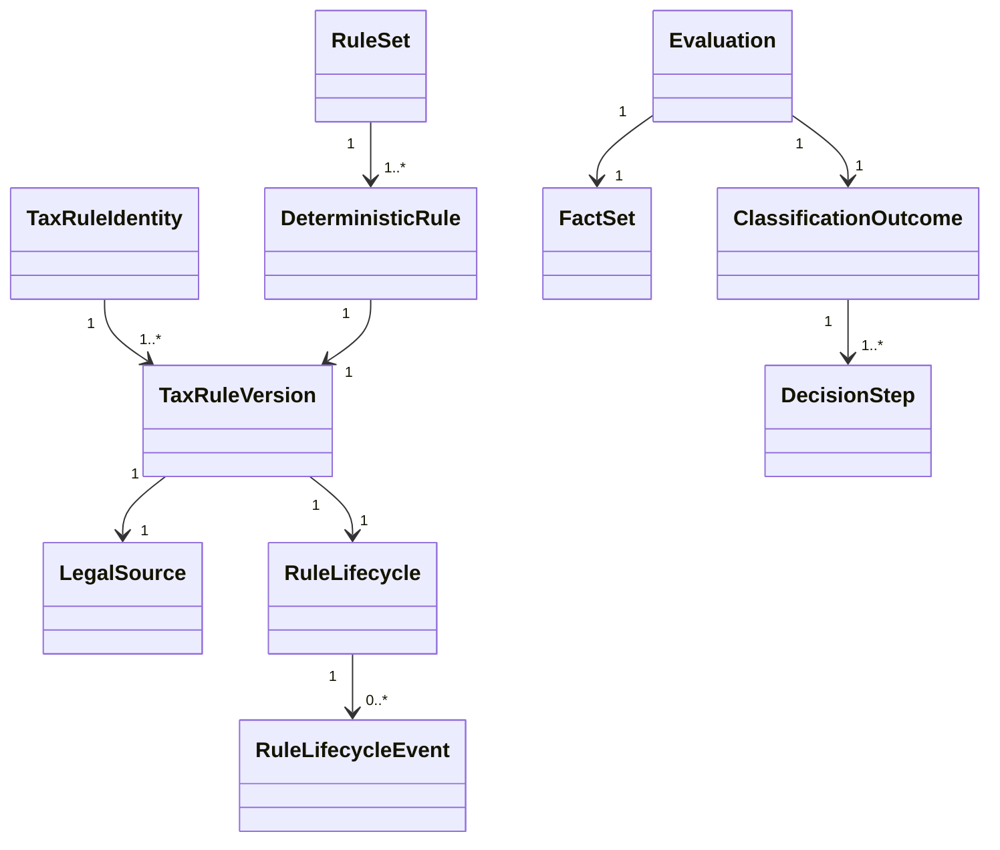
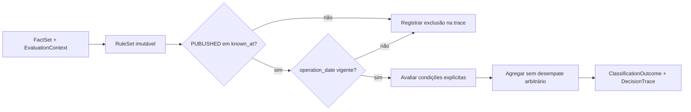

# Modelo de identidade, versão e avaliação de regras

Este modelo implementa a infraestrutura da segunda etapa. Todos os exemplos executáveis são sintéticos e não representam legislação, classificação ou alíquota brasileira.

## Agregados

### `TaxRuleIdentity`

Identidade lógica estável. Uma mudança de conteúdo ou legislação não cria outra identidade quando ainda se trata da mesma regra lógica; cria outra `TaxRuleVersion`.

### `TaxRuleVersion`

Snapshot imutável contendo versão, jurisdição, fonte/dispositivo, intervalo jurídico, origem, conteúdo canônico, hash SHA-256 e metadados de auditoria. O hash é validado contra o conteúdo na construção.

`approved_at`, `published_at` e `superseded_at` não são gravados como campos mutáveis no snapshot. São projeções derivadas dos eventos do lifecycle, conforme ADR-0007. Isso atende à necessidade de consulta sem criar duas fontes de verdade.

### `LegalSource`

Referência normativa separada com tipo de ato, número, ano, órgão emissor, dispositivo, URI oficial opcional, data de publicação, observações e hash de integridade opcional. Fontes reais continuam proibidas nesta etapa.

### `RuleLifecycle`

Histórico append-only da versão. Somente o estado `PUBLISHED` no `known_at` permite chamar a implementação determinística, e apenas quando `operation_date` pertence a `[valid_from, valid_to)`.

### `RuleSet`

Coleção ordenada e versionada de snapshots. Seu fingerprint incorpora identidade, versão, conteúdo, vigência e fonte imutáveis. Eventos posteriores do lifecycle não alteram o hash; são consultados separadamente por `known_at`.

### `FactSet`

Contrato extensível de fatos normalizados. Campos fiscais potencialmente precisos são strings. `product_attributes` permite evolução controlada sem transformar NCM/NBS em determinantes absolutos.

### `Evaluation`

Envelope auditável com identificadores, `evaluated_at`, `known_at`, hash canônico da entrada, versões de motor/ruleset, versões executadas e `ClassificationOutcome`.

## Pipeline determinístico

## Garantias atuais

- nenhuma regra não publicada é executada;
- versões e eventos são imutáveis;
- intervalos jurídicos têm término exclusivo;
- incerteza por fato ausente prevalece sobre conclusão aparente;
- candidatos distintos não são arbitrariamente reduzidos;
- a mesma entrada, `known_at`, motor e ruleset produzem a mesma decisão;
- nenhuma DSL ou expressão dinâmica foi introduzida.

## Fora do modelo atual

Persistência PostgreSQL, migrações, workflow de usuários, assinatura digital, publicação atômica de rulesets, DSL, performance em lote e regras tributárias reais. Cada item dependerá de especificação/ADR próprio.

